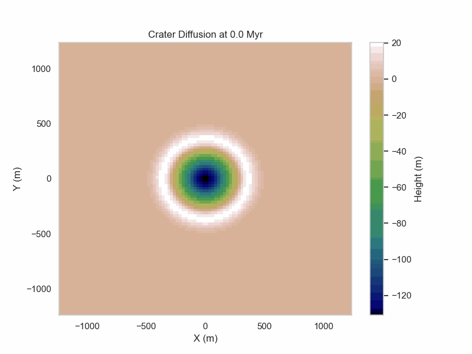

# Topographic Diffusion of Lunar Impact Craters

This repository contains code and resources for simulating and analyzing the topographic diffusion of lunar impact craters using Physics-Informed Neural Networks (PINNs). The goal is to recreate and extend the results from Fasset and Thomson (2014) and other studies.

## Directory Structure

- `crater_diffusion/`
  - `crater_diffusion_pinn.py`: Contains the `CraterDiffusionPINN` class for simulating crater diffusion using PINNs.
  - `crater_diffusion_utils.py`: Utility functions for crater topography calculations and data preparation.
  - `crater_diffusion.ipynb`: Jupyter notebook for running simulations and visualizations.
  - `files/`: Directory containing images and other resources.

## Usage

### Crater Diffusion Simulation

1. **Initial Crater Topography**: The initial topography of craters is calculated using empirical equations from various studies.

2. **1D Diffusion Simulation**: Simulate the topographic diffusion in one spatial dimension using an implicit solution.

3. **2D Diffusion Simulation**: Scale up to two spatial dimensions and simulate the diffusion using both explicit and implicit solutions.

4. **Physics-Informed Neural Network (PINN)**: Use PINNs to simulate the diffusion process and compare the results with traditional numerical methods.

### Parameter Discovery

The `KtDiscovery` class extends the `CraterDiffusionPINN` class to discover the optimal `kappa`, radius, and time values that fit a given height array.

### Example Usage

```python
import numpy as np
import tensorflow as tf
from crater_diffusion_pinn import CraterDiffusionPINN, KtDiscovery

# Define the parameters
kappa = 5.5  # Initial guess for kappa
radius = 150  # Initial guess for crater radius in meters
r_max = 2 * radius  # Maximum radial distance for sampling points
t_max = 3000  # Initial guess for time in million years

# Create the KtDiscovery instance
kt_discovery = KtDiscovery(kappa, radius, r_max, t_max)
kt_discovery.model = kt_discovery._build_network()

# Generate some synthetic data for testing
x = np.linspace(-r_max, r_max, 100)
y = np.linspace(-r_max, r_max, 100)
X, Y = np.meshgrid(x, y)
h_true = np.sin(X) * np.cos(Y)  # Replace with your actual height data

# Flatten the arrays for input to the model
x_flat = X.flatten()
y_flat = Y.flatten()
h_true_flat = h_true.flatten()

# Discover the kappa, radius, and time values
kappa_discovered, time_discovered, radius_discovered = kt_discovery.discover_parameters(x_flat, y_flat, h_true_flat, n_epochs=1000, learning_rate=0.01)

print(f"Discovered Kappa: {kappa_discovered}, Discovered Time: {time_discovered}, Discovered Radius: {radius_discovered}")
```

## Visualization

The repository includes functions for visualizing the evolution of crater topography over time and comparing the results with empirical data.

## References

- Fasset and Thomson (2014): [Link to paper](https://agupubs.onlinelibrary.wiley.com/doi/10.1002/2014JE004698)
- Yang et al. (2021): [Link to paper](http://dx.doi.org/10.1029/2021GL095537)
- Fasset et al. (2022): [Link to paper](https://agupubs.onlinelibrary.wiley.com/doi/10.1029/2022JE007510)

## License

This project is licensed under the MIT License.